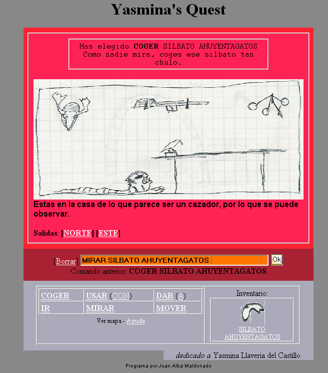

Yasmina's Quest 
================ 
by Joan Alba Maldonado (joanalbamaldonadoNO_SPAM_PLEASE AT gmail DOT com, without NO_SPAM_PLEASE)

Combination of graphical point-and-click adventure and text adventure totally written in PHP and DHTML.

Created on 17th November 2005 (approximately).

You can donate at http://sourceforge.net/donate/index.php?group_id=173640

## Description

Open source adventure game engine that comes with one adventure game example (in Spanish) totally written using PHP, HTML, CSS and JavaScript.

The games created with this engine can be played either as a point-and-click adventure (using mouse, pointer or your finger) or as a text adventure (using keyboard or any other text input method) and they are totally cross-browser and cross-platform.

Although it uses JavaScript in order to improve user interface, it is not mandatory and it works with any web browser without JavaScript support. Similarly, CSS is an advantage but not actually necessary. Even images are not necessary!

The characteristics of this engine are unique, letting developers create adventures that work in all web browsers and taking advantage of JavaScript and CSS to improve the user experience only if it is available. You will be able to play the game even in text-based web browsers such as Links and Lynx.

So far, I don't know any other engine that works in all web browsers which let users play the same adventure in both modes, point-and-click adventure and text adventure.

It has been tested under BeOS, Linux, NetBSD, OpenBSD, FreeBSD, Windows, Mac OS X, QNX, BlackBerry Tablet OS, Android, iOS and others.

This engine has been used by some other people to create their own adventure.

Play online: http://yquest.tuxfamily.org/yq_spanish/

Play online #mirror: http://www.dhtmlgames.com/yquest/yq_spanish/

Official web site: http://yquest.tuxfamily.org/ (mirror at http://www.dhtmlgames.com/yquest/).